# [Optical Music Recognition Datasets](https://apacha.github.io/OMR-Datasets/)

This repository contains a collection of many datasets used for various Optical Music Recognition tasks, including staff-line detection and removal, training of Convolutional Neuronal Networks (CNNs) or validating existing systems by comparing your system with a known ground-truth.

Note that most datasets have been developed by researchers and using their dataset requires accepting a certain license and/or citing their respective publications, as indicated for each dataset. Most datasets link to the official website, where you can download the dataset.

## Overview
The following datasets are referenced from this repository:

|                                           Name                                          	|    Engraving          	|     Size              									|     Format             								|               Typical usages              						|
|-----------------------------------------------------------------------------------------	|:---------------------:	|:-----------------------------------------------------:	|:-------------------------------------------------: 	|:-------------------------------------------------------------:	|
| [Handwritten Online Musical Symbols (HOMUS)](#handwritten-online-musical-symbols-homus) 	| Handwritten           	| 15200 symbols   	    									| Text-File             								| Symbol Classification (online + offline)  						|
| [Universal Music Symbol Collection](#universal-music-symbol-collection)                 	| Printed + Handwritten 	| ~ 90000 symbols	    									| Images                								| Symbol Classification (offline)           						|
| [CVC-MUSCIMA](#cvc-muscima)                                                             	| Handwritten           	| 1000 score images     									| Images                								| Staff line removal, writer identification 						|
| [MUSCIMA++](#muscima)                                                                   	| Handwritten           	| > 90000 annotatations 									| Images, Measure Annotations, MuNG            			| Symbol Classification, Object Detection, End-To-End Recognition, Measure Recognition 	|
| [DeepScores](#deepscores)                                                                	| Printed               	| 300000 images 	    									| Images, XML              								| Symbol Classification, Object Detection, Semantic Segmentation  	|
| [PrIMuS](#primus)                                                                     	| Printed               	| 87678 incipits 	    									| Images, MEI, Simplified encoding, agnostic encoding  	| End-to-End Recognition                                   			|
| [Baro Single Stave Dataset](#baró-single-stave-dataset)                                  	| Handwritten              	| 95 images 	    									    | Images, Simplified encoding  	                        | End-to-End Recognition                 			                |
| [Multimodal Sheet Music Dataset](#multimodal-sheet-music-dataset)                        	| Printed               	| 497 songs      	    									| Images, MIDI, Lilypond, MuNG (noteheads) 				| End-to-End Recognition, Multimodal Retrieval, Score Following     |
| [MuseScore](#musescore)                                                                 	| Printed               	| > 340000 files 	    									| MuseScore, PDF, MusicXML 								| Various                                   						|
| [MuseScore Monophonic MusicXML Dataset](#musescore-monophonic-musicxml-dataset)         	| Printed               	| 17000 IDs      	    									| IDs for MuseScore files  								| Various                                   						|
| [Capitan collection](#capitan-collection)                                               	| Handwritten              	| 10230 symbols         									| Images, Text-File    	    							| Symbol Classification                     						|
| [SEILS Dataset](#seils-dataset)                                               	        | Printed              	    | 30 madrigals, 150 original images, 930 symbolic files 	| Images (PDF), .ly, .mid, .xml, .musx, .krn, .mei, .mns, .agnostic, .semantic    	| Various                     										|
| [Rebelo Dataset](#rebelo-dataset)                                                        	| Printed               	| 15000 symbols  	    									| Images                								| Symbol Classification                     						|
| [Fornes Dataset](#fornes-dataset)                                                       	| Handwritten           	| 4100 symbols   	    									| Images                 								| Symbol Classification                     						|
| [Audiveris OMR](#audiveris-omr)                                                         	| Printed               	| 800 annotations	    									| Images, XML          	    							| Symbol Classification, Object Detection   						|
| [Printed Music Symbols Dataset](#printed-music-symbols-dataset)                         	| Printed               	| 200 symbols    	    									| Images                								| Symbol Classification                     						|
| [Music Score Classification Dataset](#music-score-classification-dataset)               	| Printed               	| 1000 score images     									| Images                								| Sheet Classification                      						|
| [OpenOMR Dataset](#openomr-dataset)                                                     	| Printed               	| 706 symbols    	    									| Images                								| Symbol Classification                     						|
| [Gamera MusicStaves Toolkit](#gamera-musicstaves-toolkit)                                	| Printed               	| 32 score images	    									| Images                								| Staff line removal                        						|
| [Early Typographic Prints](#early-typographic-prints)                                   	| Printed               	| 240 score images      									|                       								|                                           						|
| [Silva Online Handwritten Symbols](#silva-online-handwritten-symbols)                   	| Handwritten           	| 12600 symbols  	    									|                       								|                                           						|
| [IMSLP](#imslp)                                                                         	| Printed               	| >420000 score images  									| PDF                      								| Various                                      						|
| [Byrd Dataset](#byrd-dataset)                                                           	| Printed               	| 34 score images	    									| Images                   								| Various                                      						|
| [Bounding Box Annotations of Musical Measures](#bounding-box-annotations-of-musical-measures)                                                           	| Printed               	| 940 score images; 24,329 bounding boxes	    									| Images                   								| Box Annotation Detection                                      						|

If you find mistakes or know of any relevant datasets, that are missing in this list, please [open an issue](https://github.com/apacha/OMR-Datasets/issues/new) or directly file a pull request.

## Tools for working with the datasets
A collection of tools that simplify the downloading and handling of datasets used for Optical Music Recognition (OMR).
These tools are available as Python package ``omrdatasettools`` on PyPi.

    

# Handwritten Online Musical Symbols (HOMUS)

**Official website**: [http://grfia.dlsi.ua.es/homus/](http://grfia.dlsi.ua.es/homus/)

**Summary**: The Handwritten Online Musical Symbols (HOMUS) dataset is a reference corpus with around 15000 samples for research on the recognition of online handwritten music notation. For each sample, the individual strokes that the musicians wrote on a Samsung Tablet using a stylus were recorded and can be used in online and offline scenarios.

**Scientific Publication**: J. Calvo-Zaragoza and J. Oncina, "Recognition of Pen-Based Music Notation: The HOMUS Dataset," 2014 22nd International Conference on Pattern Recognition, Stockholm, 2014, pp. 3038-3043. [DOI: 10.1109/ICPR.2014.524](http://dx.doi.org/10.1109/ICPR.2014.524)

**Example**:

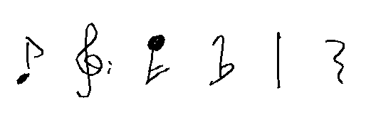

*Remarks*: The original dataset contains around 20 artifacts and misclassifications that were reported to the authors and [corrected by Alexander Pacha](https://github.com/apacha/Homus).

# Universal Music Symbol Collection

**Official website**: [https://github.com/apacha/MusicSymbolClassifier](https://github.com/apacha/MusicSymbolClassifier), [Slides](https://docs.google.com/presentation/d/14g97TnrcI9o-5D6DIY-dMFfBp9kUAqpbe86c-VE83Bk/edit?usp=sharing)

**Summary**: A collection of various other datasets which combines 7 datasets into a large unified dataset of 90000 tiny music symbol images from 79 classes that can be used to train a universal music symbol classifier. 74000 symbols are handwritten and 16000 are printed symbols.

**Scientific Publication**: Alexander Pacha, Horst Eidenberger. Towards a Universal Music Symbol Classifier. Proceedings of the 12th IAPR International Workshop on Graphics Recognition, Kyoto, Japan, November 2017. [DOI: 10.1109/ICDAR.2017.265](http://dx.doi.org/10.1109/ICDAR.2017.265)

**Example**:

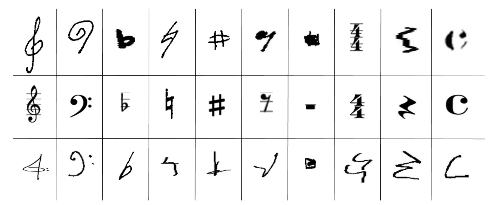

# CVC-MUSCIMA

**Official website**: [http://www.cvc.uab.es/cvcmuscima/index_database.html](http://www.cvc.uab.es/cvcmuscima/index_database.html)

**Summary**: The CVC-MUSCIMA database contains handwritten music score images, which has been specially designed for writer identification and staff removal tasks. The database contains 1,000 music sheets written by 50 different musicians. All of them are adult musicians, in order to ensure that they have their own characteristic handwriting style. Each writer has transcribed the same 20 music pages, using the same pen and the same kind of music paper (with printed staff lines). The set of the 20 selected music sheets contains music scores for solo instruments and music scores for choir and orchestra.

**Scientific Publication**: Alicia Fornés, Anjan Dutta, Albert Gordo, Josep Lladós. CVC-MUSCIMA: A Ground-truth of Handwritten Music Score Images for Writer Identification and Staff Removal. International Journal on Document Analysis and Recognition, Volume 15, Issue 3, pp 243-251, 2012. [DOI: 10.1007/s10032-011-0168-2](http://dx.doi.org/10.1007/s10032-011-0168-2)

**Example**:

# MUSCIMA++

**Official website**: [https://ufal.mff.cuni.cz/muscima](https://ufal.mff.cuni.cz/muscima)

**Current development**: [https://github.com/OMR-Research/muscima-pp](https://github.com/OMR-Research/muscima-pp)

**Summary**: MUSCIMA++ is a dataset of handwritten music notation for musical symbol detection that is based on the MUSCIMA dataset. It contains 91255 symbols, consisting of both notation primitives and higher-level notation objects, such as key signatures or time signatures. There are 23352 notes in the dataset, of which 21356 have a full notehead, 1648 have an empty notehead, and 348 are grace notes. Composite objects, such as notes, are captured through explicitly annotated relationships of the notation primitives (noteheads, stems, beams...). This way, the annotation provides an explicit bridge between the low-level and high-level symbols described in Optical Music Recognition literature.

**Scientific Publication**: Jan Hajič jr., Pavel Pecina. The MUSCIMA++ Dataset for Handwritten Optical Music Recognition. 14th International Conference on Document Analysis and Recognition, ICDAR 2017. Kyoto, Japan, November 13-15, pp. 39-46, 2017. [DOI: 10.1109/ICDAR.2017.16](http://dx.doi.org/10.1109/ICDAR.2017.16)

**Example**:

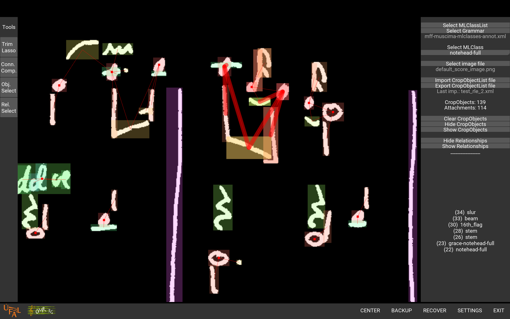

*Remarks*: Since this dataset is derived from the CVC-MUSCIMA dataset, using it requires to reference the CVC-MUSCIMA as well.

## MUSCIMA++ Measure Annotations

**Website**: [https://omr-datasets.readthedocs.io/en/latest/downloaders/MuscimaPlusPlusDatasetDownloader.html](https://omr-datasets.readthedocs.io/en/latest/downloaders/MuscimaPlusPlusDatasetDownloader.html)

**Summary**: Based on the MUSCIMA++ dataset, a subset of the annotations was constructed, that contains only annotations for measure and stave recognition.
The dataset has some errors fixed that version MUSCIMA++ 1.0 exhibits and comes in a plain JSON format, as well as in the COCO format.

This dataset was created by [Alexander Pacha](https://alexanderpacha.com).

**Example**:

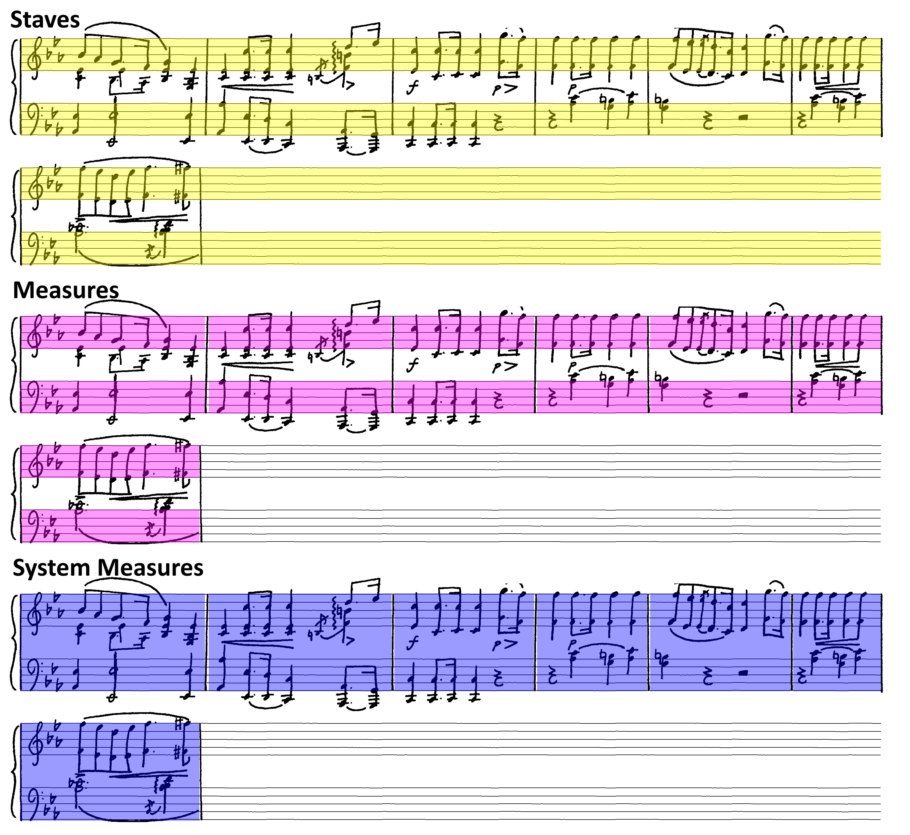

# DeepScores

**Official website**: [https://tuggeluk.github.io/deepscores/](https://tuggeluk.github.io/deepscores/)

**Summary**: Synthetic dataset of 300000 annotated images of written music for object classification, semantic segmentation and object detection. Based on a large set of MusicXML documents that were obtained from [MuseScore](#musescore), a sophisticated pipeline is used to convert the source into LilyPond files, for which LilyPond is used to engrave and annotate the images. Images are rendered in five different fonts to create a variation of the visual appearance.

**Scientific Publication**: Lukas Tuggener, Isamil Elezi, Jürgen Schmidhuber, Marcello Pelillo, Thilo Stadelmann. DeepScores - A Dataset for Segmentation, Detection and Classification of Tiny Objects. ICPR 2018. 2018. [https://arxiv.org/abs/1804.00525](https://arxiv.org/abs/1804.00525)

**Example**:

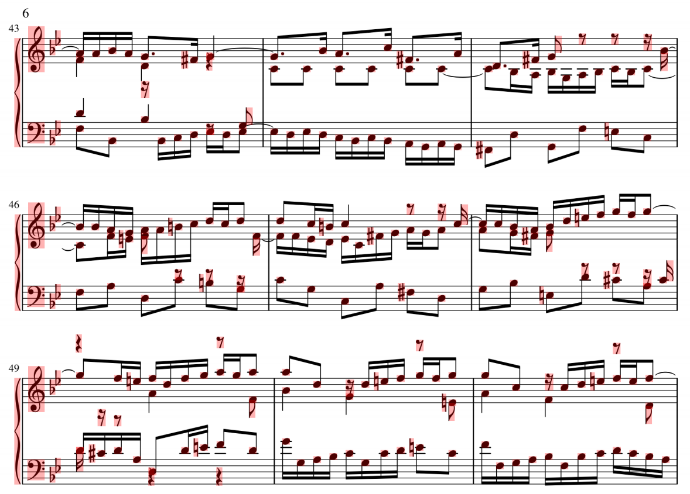

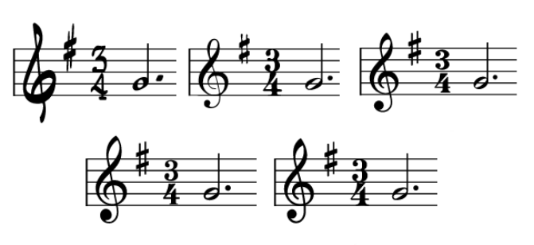

# PrIMuS

**Official website**: [https://grfia.dlsi.ua.es/primus/](https://grfia.dlsi.ua.es/primus/)

**Summary**: The Printed Images of Music Staves (PrIMuS) contains the 87678 real-music incipits (an incipit is a sequence of notes, typically the first ones, used for identifying a melody or musical work) in five different formats: As rendered PNG image, as MIDI-file, als MEI-file and as two custom encodings (semantic encoding and agnostic encoding). The incipits are originally taken from the [RISM dataset](http://opac.rism.info/).

PrIMuS has been extended into the [Camera-PrIMuS dataset](https://grfia.dlsi.ua.es/primus/) that contains the same scores, but the images have been distorted to simulate imperfections introduced by taking pictures of sheet music in a real scenario.

**Scientific Publications**:
- Jorge Calvo-Zaragoza and David Rizo. End-to-End Neural Optical Music Recognition of Monophonic Scores. Applied Sciences, 2018, 8, 606. [http://www.mdpi.com/2076-3417/8/4/606](http://www.mdpi.com/2076-3417/8/4/606) (for PrIMuS)
- Jorge Calvo-Zaragoza and David Rizo. Camera-PrIMuS: Neural end-to-end Optical Music Recognition on realistic monophonic scores. In Proceedings of the 19th International Society for Music Information Retrieval Conference, Paris, 2018. [http://ismir2018.ircam.fr/doc/pdfs/33.pdf](http://ismir2018.ircam.fr/doc/pdfs/33.pdf) (for Camera-PrIMuS)

**Example**:

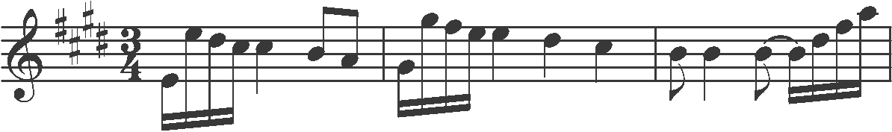

# Baró Single Stave Dataset

**Official website**: [http://www.cvc.uab.es/people/abaro/datasets.html](http://www.cvc.uab.es/people/abaro/datasets.html)

**Summary**: The Single Stave dataset by Arnau Baró is a derived dataset from the CVC-MUSCIMA dataset and contains 95 single stave music scores with ground truth labels on the symbol level.

**Scientific Publication**: Arnau Baró, Pau Riba, Jorge Calvo-Zaragoza, and Alicia Fornés. From Optical Music Recognition to Handwritten Music Recognition: a Baseline. Patter Recognition Letters, 2019 (in press). [DOI: 10.1016/j.patrec.2019.02.029](https://doi.org/10.1016/j.patrec.2019.02.029)

**Example**:

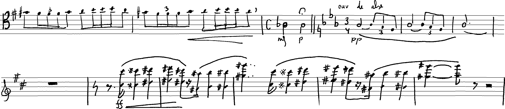

# Multimodal Sheet Music Dataset

**Official website**: [https://github.com/CPJKU/msmd](https://github.com/CPJKU/msmd)

**Summary**: MSMD is a synthetic dataset of 497 pieces of (classical) music that contains both audio and score representations of the pieces aligned at a fine-grained level (344,742 pairs of noteheads aligned to their audio/MIDI counterpart). It can be used for training and evaluating multimodal models that enable crossing from one modality to the other, such as retrieving sheet music using recordings or following a performance in the score image.

**Scientific Publications**:
- Matthias Dorfer, Jan Hajič jr., Andreas Arzt, Harald Frostel, Gerhard Widmer. [Learning Audio-Sheet Music Correspondences for Cross-Modal Retrieval and Piece Identification](https://transactions.ismir.net/articles/10.5334/tismir.12/). Transactions of the International Society for Music Information Retrieval, issue 1, 2018.

**Example**:

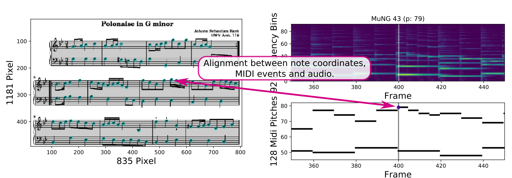

# MuseScore

**Official website**: [https://musescore.com/sheetmusic](https://musescore.com/sheetmusic)

**Summary**: [MuseScore](https://musescore.org/) is a free music notation software and also allows their users to upload their sheet music to their website and share it with others. Currently (Jan. 2018) the website hosts over 340000 music sheets, that can be downloaded as MuseScore file (mscz), PDF, MusicXML, MIDI and MP3.

**Publication**: [https://musescore.org](https://musescore.org)

**Example**:

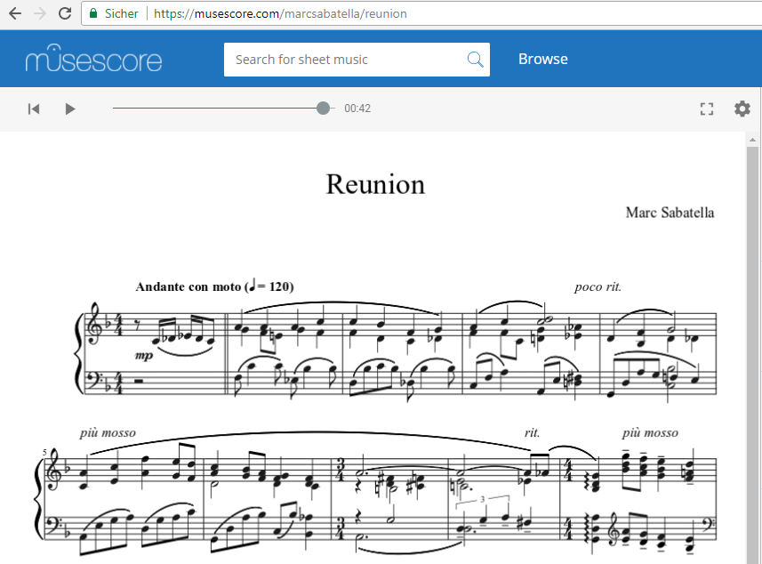

# MuseScore Monophonic MusicXML Dataset

**Official website**: [https://github.com/eelcovdw/mono-musicxml-dataset](https://github.com/eelcovdw/mono-musicxml-dataset)

**Summary**: This dataset contains the IDs to 17000 monophonic scores, that can be downloaded from musescore.com. A sample script is given that downloads one score, given you've obtained a developer key from the MuseScore developers.  

**Scientific Publication**: Eelco van der Wel, Karen Ullrich. Optical Music Recognition with Convolutional Sequence-to-Sequence Models. CoRR, arXiv:1707.04877, 2017. [https://arxiv.org/abs/1707.04877](https://arxiv.org/abs/1707.04877)

**Examples**:

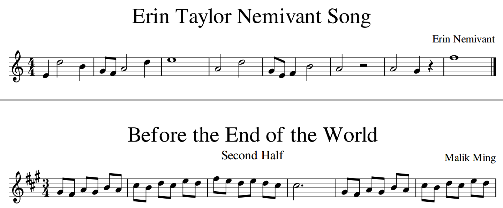

# Capitan collection

**Official website**: [http://grfia.dlsi.ua.es/](http://grfia.dlsi.ua.es)

 (Freely available for research purposes)

**Summary**: A corpus collected by an electronic pen while tracing isolated music symbols from Early manuscripts. The dataset contains information of both the sequence followed by the pen and the patch of the source under the tracing itself. In total it contains 10230 samples unevenly spread over 30 classes. Each symbol is described as stroke (capitan stroke) and including the piece of score below it (capitan score).

**Scientific Publication**: Jorge Calvo-Zaragoza, David Rizo and Jose M. Iñesta. Two (note) heads are better than one: pen-based multimodal interaction with music scores. Proceedings of the 17th International Society of Music Information Retrieval conference, 2016. [Download the PDF](http://grfia.dlsi.ua.es/repositori/grfia/pubs/345/two-note-heads.pdf)

**Example**:

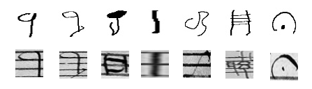

*Remarks*: This dataset exists in two flavours:

* As raw dataset, which contains only the textual descriptions of the strokes and the images, called *Bimodal music symbols from Early notation*. This format is similar to the HOMUS dataset.
* As rendered images inside of the *Isolated handwritten music symbols* dataset. Also refered to as Capitan collection.

# SEILS Dataset

**Official website**: [https://github.com/SEILSdataset/SEILSdataset](https://github.com/SEILSdataset/SEILSdataset)

**Summary**: The SEILS dataset is a corpus of scores in lilypond, music XML, MIDI, Finale, **kern, MEI, **mens, agnostic, semantic and pdf formats, in white mensural and modern notation. The transcribed scores have been taken from the 16th century anthology of Italian madrigals Il Lauro Secco, published for the first time in 1582 by Vittorio Baldini in Ferrara (Italy). The corpus contains scores of 30 different madrigals for five unaccompanied voices composed by a variety of composers.

**Scientific Publication**: Emilia Parada-Cabaleiro, Anton Batliner, Alice Baird, Björn W. Schuller. The SEILS dataset: Symbolically Encoded Scores in ModernAncient Notation for Computational Musicology. Proceedings of the 18th International Society of Music Information Retrieval conference, 2017, Suzhou, P.R. China, pp. 575-581. [Download the PDF](https://ismir2017.smcnus.org/wp-content/uploads/2017/10/14_Paper.pdf)

**Scientific Publication**: Emilia Parada-Cabaleiro, Maximilian Schmitt, Anton Batliner, Björn W. Schuller. Musical-Linguistic annotation of Il Lauro Secco. Proceedings of the 19th International Society of Music Information Retrieval conference, 2018, Paris, France, pp. 461-467. [Download the PDF](http://ismir2018.ircam.fr/doc/pdfs/11_Paper.pdf)

**Scientific Publication**: Emilia Parada-Cabaleiro, Anton Batliner, Björn W. Schuller. A diplomatic edition of Il Lauro Secco: Ground truth for OMR of white mensural notation. Proceedings of the 20th International Society of Music Information Retrieval conference, 2019, Delft, The Netherlands, pp. 557-564. [Download the PDF](http://archives.ismir.net/ismir2019/paper/000067.pdf)

**Example**:

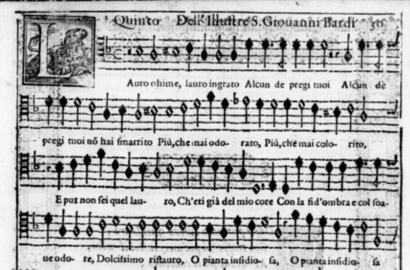
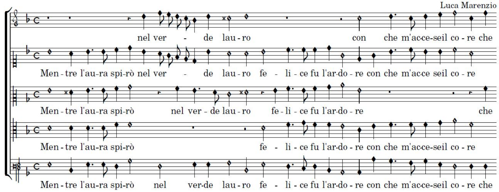

# Rebelo Dataset

**Official websites**: [http://www.inescporto.pt/~arebelo/index.php](http://www.inescporto.pt/~arebelo/index.php) and [http://www.inescporto.pt/~jsc/projects/OMR/](http://www.inescporto.pt/~jsc/projects/OMR/)

**Summary**: Three datasets of perfect and scanned music symbols including an extensive set of synthetically modified images for staff-line detection and removal. Contains approximately 15000 music symbols.

**Scientific Publication**: A. Rebelo, G. Capela, and J. S. Cardoso, "Optical recognition of music symbols: A comparative study" in International Journal on Document Analysis and Recognition, vol. 13, no. 1, pp. 19-31, 2010. [DOI: 10.1007/s10032-009-0100-1](http://dx.doi.org/10.1007/s10032-009-0100-1)

**Examples**:

*Remarks*: The dataset is usually only available upon request, but with written permission of Ana Rebelo I hereby make the datasets available under a permissive CC-BY-SA license, which allows you to use it freely given you properly mention her work by citing the above mentioned publication: [Download the dataset](https://github.com/apacha/OMR-Datasets/releases/download/datasets/Rebelo.Dataset.zip).

# Fornes Dataset
**Official website**: [http://www.cvc.uab.es/~afornes/](http://www.cvc.uab.es/~afornes/)

**Summary**: A dataset of 4100 black and white symbols of 7 different symbol classes: flat, natural, sharp, double-sharp, c-clef, g-clef, f-clef.

**Scientific Publication**: A.Fornés and J.Lladós and G. Sanchez, "Old Handwritten Musical Symbol Classification by a Dynamic Time Warping Based Method", in Graphics Recognition: Recent Advances and New Opportunities. Liu, W. and Lladós, J. and Ogier, J.M. editors, Lecture Notes in Computer Science, Volume 5046, Pages 51-60, Springer-Verlag Berlin, Heidelberg, 2008. [DOI: 10.1007/978-3-540-88188-9_6
](http://dx.doi.org/10.1007/978-3-540-88188-9_6)

**Example**:

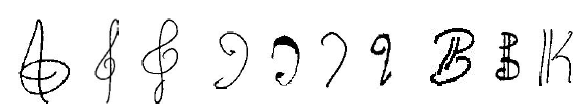

# Audiveris OMR

**Official website**: [https://github.com/Audiveris/omr-dataset-tools](https://github.com/Audiveris/omr-dataset-tools)

**Summary**: A collection of four music sheets with approximately 800 annotated music symbols. The [DeepScore project](https://www.zhaw.ch/no_cache/en/research/people-publications-projects/detail-view-project/projekt/2895/) in cooperation with the ZHAW targets towards [automatically generating these images](https://github.com/Audiveris/omr-dataset-tools/wiki/Synthetic-Images) and the annotations from MuseScore or Lilypond documents.

**Example**:

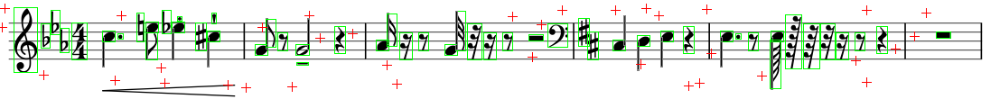

# Printed Music Symbols Dataset

**Official website**: [https://github.com/apacha/PrintedMusicSymbolsDataset](https://github.com/apacha/PrintedMusicSymbolsDataset)

**Summary**: A small dataset of about 200 printed music symbols out of 36 different classes. Partially with their context (staff-lines, other symbols) and partially isolated.

**Example**:

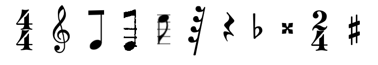

# Music Score Classification Dataset

**Official website**: [https://github.com/apacha/MusicScoreClassifier](https://github.com/apacha/MusicScoreClassifier)

**Summary**: A dataset of 2000 images, containing 1000 images of music scores and 1000 images of other objects including text documents. The images were taken with a smartphone camera from various angles and different lighting conditions.

**Scientific Publication**: Alexander Pacha, Horst Eidenberger, Towards Self-Learning Optical Music Recognition. 2017 16th IEEE International Conference on Machine Learning and Applications (ICMLA), Cancún, Mexiko, Dezember 2017. [DOI: 10.1109/ICMLA.2017.00-60](http://dx.doi.org/10.1109/ICMLA.2017.00-60)

**Example**:

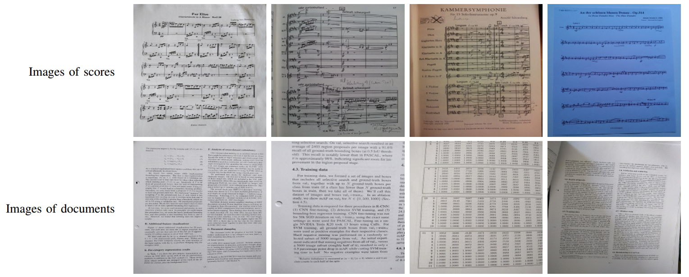

# OpenOMR Dataset

**Official website**: [http://sourceforge.net/projects/openomr/](http://sourceforge.net/projects/openomr/)

**Summary**: A dataset of 706 symbols (g-clef, f-clef) and symbol primitives (note-heads, stems with flags, beams) of 16 classes created by Arnaud F. Desaedeleer as part of his master thesis to train artificial neural networks.

**Scientific Publication**: Arnaud F. Desaedeleer, "Reading Sheet Music", Master Thesis, University of London, September 2006, [Download](http://sourceforge.net/projects/openomr/)

**Example**:

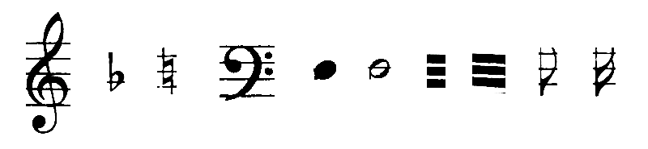

# Gamera MusicStaves Toolkit

**Official website**: [http://music-staves.sf.net/](http://music-staves.sf.net/) and [https://github.com/hsnr-gamera](https://github.com/hsnr-gamera)

**Summary**: The Synthetic Score Database by Christoph Dalitz that contains 32 scores that have been computer generated with different music typesetting programs. It contains ground truth data and is suitable for the deformations implemented in the toolkit.

**Scientific Publication**: C. Dalitz, M. Droettboom, B. Pranzas, I. Fujinaga: A Comparative Study of Staff Removal Algorithms. IEEE Transactions on Pattern Analysis and Machine Intelligence, vol. 30, no. 5, pp. 753-766 (2008) [DOI: 10.1109/TPAMI.2007.70749](http://dx.doi.org/10.1109/TPAMI.2007.70749)

**Example**:

# Early Typographic Prints

**Summary**: 240 pages of early typographic music having a total of 1478 staves and 52178 characters corresponding to 175 different symbols with ground-truth obtained by manually entering via a MIDI keyboard.

**Scientific Publication**: Laurent Pugin. Optical Music Recognition of Early Typographic Prints using Hidden Markov Models. 7th International Conference on Music Information Retrieval (ISMIR’06), Victoria, Canada, October 2006. [http://www.aruspix.net/publications/pugin06optical.pdf](http://www.aruspix.net/publications/pugin06optical.pdf)

**Example**:

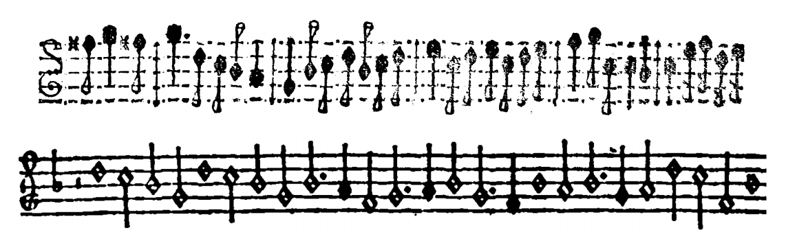

# Silva Online Handwritten Symbols

**Summary**: Dataset of 12600 trajectories of handwritten music symbols, drawn by 50 writers with an Android application. Every writer drew each of the 84 different symbols three times.

**Scientific Publication**: Rui Miguel Filipe da Silva. Mobile framework for recognition of musical characters. Master Thesis. Universidade do Porto, June 2013. [https://repositorio-aberto.up.pt/bitstream/10216/68500/2/26777.pdf](https://repositorio-aberto.up.pt/bitstream/10216/68500/2/26777.pdf)

# IMSLP

**Official website**: [http://imslp.org](http://imslp.org)

**Summary**: The Petrucci Music Library is the largest collection of public domain music, with over 420000 (Jan. 2018) freely available PDF scores by almost 16000 composers accompanied by almost 50000 recordings. It also maintains an extensive list of [other music score websites](http://imslp.org/wiki/IMSLP:Other_music_score_websites), where you can find many more music sheets, e.g. collected during research projects by universities.

**Example**:

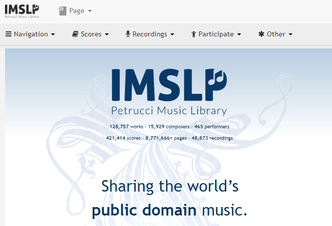

# Byrd Dataset

**Official website**: [~~http://www.diku.dk/hjemmesider/ansatte/simonsen/suppmat/jnmr/~~](http://www.diku.dk/hjemmesider/ansatte/simonsen/suppmat/jnmr/) (broken). Download from [Github mirror](https://github.com/apacha/OMR-Datasets/releases/download/datasets/ByrdOmrTestCorpus.zip).

 (Authors want to be contacted)

**Summary**: A small dataset of 34 high quality images with individual music score pages of increasing difficulty.

**Scientific Publication**: Donald Byrd & Jakob Grue Simonsen: "Towards a Standard Testbed for Optical Music Recognition: Definitions, Metrics, and Page Images". Journal of New Music Research, vol 44, nr.3, pages 169-195, 2015. [DOI: 10.1080/09298215.2015.1045424](http://dx.doi.org/10.1080/09298215.2015.1045424)

**Example**:

# Bounding Box Annotations of Musical Measures

**Official website**: [https://www.audiolabs-erlangen.de/resources/MIR/2019-ISMIR-LBD-Measures](https://www.audiolabs-erlangen.de/resources/MIR/2019-ISMIR-LBD-Measures)

**Summary**: The data set provides measure annotations for several hundred pages of sheet music, including the complete cycle *Der Ring des Nibelungen* by Richard Wagner, selected piano sonatas by Ludwig von Beethoven, the complete cycle *Winterreise* by Franz Schubert, as well as selected pieces from the Carus publishing house.

**Scientific Publication**: Frank Zalkow, Angel Villar Corrales, TJ Tsai, Vlora Arifi-Müller, and Meinard Müller: "Tools for Semi-Automatic Bounding Box Annotation of Musical Measures in Sheet Music". Late Breaking/Demo at the 20th International Society for Music Information Retrieval, Delft, The Netherlands, 2019. [Download the PDF](http://archives.ismir.net/ismir2019/latebreaking/000006.pdf)

**Example**:

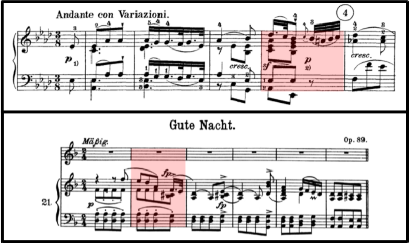
